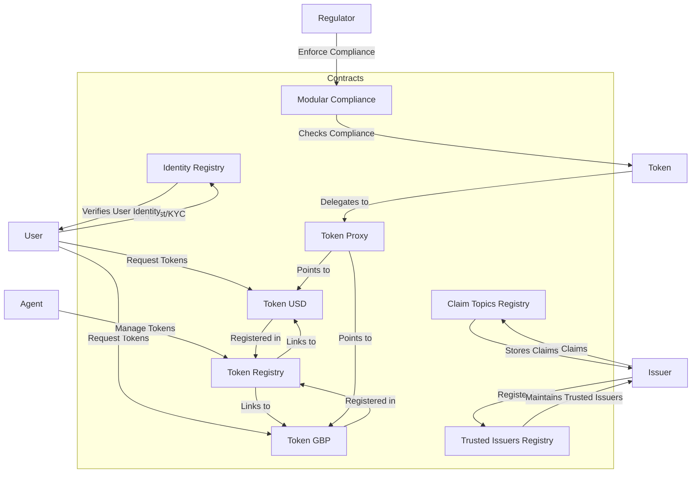
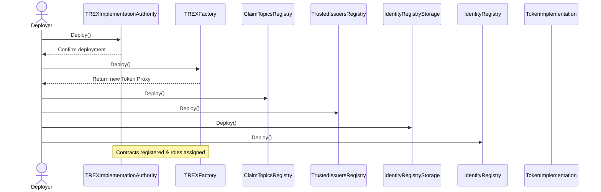
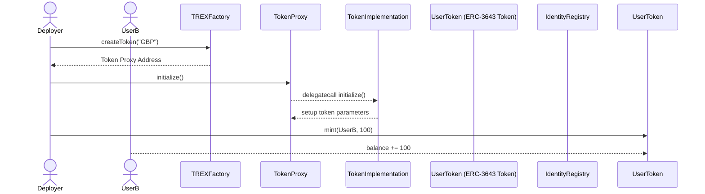
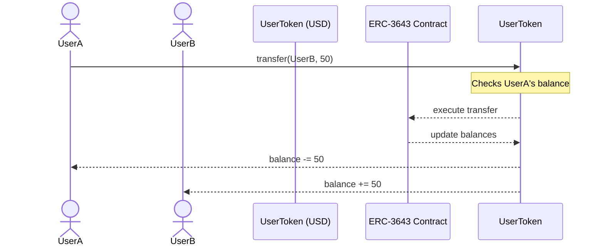

# ERC-3643: Roles & Contracts Overview

ERC-3643 (formerly T-REX Protocol) is an open-source standard for permissioned tokens, enabling compliant issuance, management, and transfer of digital securities. For more details, see the [official ERC-3643 page](https://tokeny.com/erc3643/).

---

## Roles

### 1. Issuer / Agent
- **Role:** The entity responsible for creating and managing the permissioned token.
- **Operations:**
  - Mint, burn, block, or force transfer tokens
  - Assign or revoke roles and permissions
  - Update compliance rules
  - Recover lost tokens
- **Contracts Interacted With:**
  - Token contract (ERC-3643 Token)
  - Compliance contracts (e.g., ModularCompliance, ICompliance)
  - Identity Registry contracts

### 2. Investor / Token Holder
- **Role:** The end user who holds and transfers permissioned tokens.
- **Operations:**
  - Hold and transfer tokens (subject to compliance)
  - Recover tokens (with proof of identity)
  - View portfolio and transaction history
- **Contracts Interacted With:**
  - Token contract
  - Identity Registry (for identity validation)

### 3. Compliance Agent
- **Role:** Manages and enforces compliance rules for token transfers.
- **Operations:**
  - Define and update compliance modules (e.g., whitelisting, transfer restrictions)
  - Approve or reject transfers based on rules
- **Contracts Interacted With:**
  - Compliance contracts (e.g., ModularCompliance, ICompliance)
  - Token contract

### 4. Identity Verifier / Trusted Issuer
- **Role:** Validates and attests to the identity of investors.
- **Operations:**
  - Register and update identities
  - Issue claims or credentials
- **Contracts Interacted With:**
  - Identity Registry
  - Trusted Issuers Registry

---

## Contracts

### 1. Token Contract (ERC-3643 Token)
- **Used By:** Issuer, Investor, Compliance Agent
- **Operations:**
  - Mint, burn, transfer, force transfer, block tokens
  - Query balances and transaction history
  - Enforce compliance on transfers
- **Reference:** [ERC-3643 Overview](https://tokeny.com/erc3643/)

### 2. Compliance Contracts (e.g., ModularCompliance, ICompliance)
- **Used By:** Issuer, Compliance Agent
- **Operations:**
  - Define and update compliance modules
  - Enforce transfer restrictions (e.g., whitelisting, country restrictions, limits)
- **Reference:** [ERC-3643 Compliance](https://tokeny.com/erc3643/)

### 3. Identity Registry
- **Used By:** Issuer, Investor, Identity Verifier
- **Operations:**
  - Register and update investor identities
  - Validate eligibility for transfers
- **Reference:** [ERC-3643 Identity](https://tokeny.com/erc3643/)

### 4. Trusted Issuers Registry
- **Used By:** Issuer, Identity Verifier
- **Operations:**
  - Register trusted identity verifiers
  - Manage attestation sources
- **Reference:** [ERC-3643 Trusted Issuers](https://tokeny.com/erc3643/)

---

For more information, see the [Tokeny ERC-3643 page](https://tokeny.com/erc3643/) and the [ERC-3643 GitHub repository](https://github.com/TokenySolutions/ERC3643).

---

## Example Scenarios

Below are common end-to-end flows for ERC-3643 permissioned tokens. Each scenario lists the high-level steps, the actor responsible, and how they interact with the ERC-3643 contracts.

### 1. Onboarding a New Investor
1. **Investor submits identity documents**  
   *Actor:* Investor → Identity Verifier  
   *Interaction:* Off-chain (KYC/AML process)
2. **Identity Verifier attests to investor's identity**  
   *Actor:* Identity Verifier  
   *Interaction:* Calls Identity Registry to register/update investor's identity
3. **Issuer mints tokens to investor**  
   *Actor:* Issuer  
   *Interaction:* Calls Token contract to mint tokens to investor's address (only possible if identity is valid and compliant)

### 2. Secondary Trading (Peer-to-Peer Transfer)
1. **Investor A initiates transfer to Investor B**  
   *Actor:* Investor A  
   *Interaction:* Calls Token contract to transfer tokens to Investor B
2. **Compliance check is performed**  
   *Actor:* Compliance Agent (automated via contract)  
   *Interaction:* Token contract queries Compliance contract to validate transfer (e.g., both parties are eligible, not blacklisted, within limits)
3. **Transfer is executed if compliant**  
   *Actor:* Token contract (automated)  
   *Interaction:* Tokens are transferred if compliance passes

### 3. Freezing an Account
1. **Issuer/Compliance Agent decides to freeze an account**  
   *Actor:* Issuer or Compliance Agent  
   *Interaction:* Calls Compliance contract or Token contract to block the investor's address
2. **Frozen account cannot transfer or receive tokens**  
   *Actor:* Token contract (enforced automatically)  
   *Interaction:* Compliance checks block all transfers involving the frozen address

### 4. Forcing a Transfer (e.g., Regulatory Action)
1. **Issuer/Agent initiates a forced transfer**  
   *Actor:* Issuer/Agent  
   *Interaction:* Calls Token contract's forceTransfer function to move tokens from one address to another, bypassing normal compliance
2. **Compliance Agent may log or review the action**  
   *Actor:* Compliance Agent  
   *Interaction:* (Optional) Off-chain or on-chain logging/review

### 5. Account Recovery (Lost Access)
1. **Investor proves identity to Issuer/Identity Verifier**  
   *Actor:* Investor → Issuer/Identity Verifier  
   *Interaction:* Off-chain (identity proof)
2. **Issuer/Agent updates registry and reassigns tokens**  
   *Actor:* Issuer/Agent  
   *Interaction:* Calls Identity Registry to update investor's address, then Token contract to transfer or re-mint tokens to new address

### 6. Proving Identity or Claims
1. **Investor requests proof of eligibility (e.g., for transfer or redemption)**  
   *Actor:* Investor  
   *Interaction:* Off-chain or via dApp UI
2. **System queries Identity Registry and Trusted Issuers Registry**  
   *Actor:* dApp/Smart Contract  
   *Interaction:* Reads from Identity Registry and Trusted Issuers Registry to verify claims/credentials
3. **Investor presents proof to third party**  
   *Actor:* Investor  
   *Interaction:* Off-chain or via dApp, using on-chain data as evidence

---

### Description

- **Contracts**:
  - **Token USD / Token GBP**: The actual ERC-3643 tokens for USD and GBP.
  - **Token Registry**: Keeps track of deployed tokens.
  - **Claim Topics Registry**: Stores claims issued by issuers.
  - **Trusted Issuers Registry**: Maintains list of trusted issuers.
  - **Identity Registry**: Verifies user identities.
  - **Modular Compliance**: Ensures token transactions comply with rules.
  - **Token Proxy**: Proxy contract pointing to specific token implementations.

- **Actors & Roles**:
  - **User**: Initiates token transactions, KYC, etc.
  - **Issuer**: Issues claims and registers as trusted.
  - **Agent**: Manages tokens within the registry.
  - **Regulator**: Enforces compliance rules.

- **Interactions**:
  - Users request tokens (USD/GBP) after identity verification.
  - Issuers issue claims and register as trusted.
  - Agents manage tokens within the registry.
  - Tokens are registered and linked via proxies.
  - Identity and claim registries facilitate user verification.
  - Compliance checks are enforced during transactions.

---

### Additional Notes:

- This diagram provides a high-level overview; you can extend it with specific methods (e.g., `issueClaim()`, `transfer()`) or more detailed roles.
- The actual smart contract functions and their interactions can be mapped in more detailed diagrams if needed.

---

```mermaid
%%{init: {'themeVariables': {'nodeTextColor': '#000000'}}}%%
graph TD

  %% --- Contracts ---
  subgraph Contracts
    TREXImplementationAuthority[TREXImplementationAuthority]
    TREXFactory[TREXFactory]
    TokenProxy[Token Proxy]
    #[Token Implementation]
    IdentityFactory[Identity Factory]
    IdentityRegistry[Identity Registry]
    IdentityRegistryStorage[Identity Registry Storage]
    ClaimTopicsRegistry[Claim Topics Registry]
    TrustedIssuersRegistry[Trusted Issuers Registry]
    ModularCompliance[Modular Compliance]
    DefaultCompliance[Default Compliance]
    TokenUSD[Token USD]
    TokenGBP[Token GBP]
    Registry[Token Registry]
    Proxy[Token Proxy]
  end

  %% --- Roles / Actors ---
  subgraph Roles
    User[User]
    Issuer[Issuer]
    Agent[Agent]
    Regulator[Regulator]
    Deployer[Deployer]
  end

  %% --- Operations / Relationships ---

  %% Deployment & Initialization
  Deployer -- "Deploys" --> TREXImplementationAuthority
  Deployer -- "Deploys" --> TREXFactory
  Deployer -- "Deploys" --> ClaimTopicsRegistry
  Deployer -- "Deploys" --> TrustedIssuersRegistry
  Deployer -- "Deploys" --> IdentityRegistryStorage
  Deployer -- "Deploys" --> IdentityRegistry
  Deployer -- "Deploys" --> #
  Deployer -- "Deploys" --> IdentityFactory
  Deployer -- "Deploys" --> TokenUSD
  Deployer -- "Deploys" --> TokenGBP

  %% Setting up TREX and Factory
  TREXImplementationAuthority -- "Authorizes" --> TREXFactory
  TREXFactory -- "Creates new Token Proxies" --> TokenProxy
  TokenProxy -- "Points to" --> #

  %% Registering and Managing Contracts
  TREXImplementationAuthority -- "Grant roles & manage versions" --> ClaimTopicsRegistry
  TREXImplementationAuthority -- "Grant roles & manage versions" --> TrustedIssuersRegistry
  TREXImplementationAuthority -- "Grant roles & manage versions" --> IdentityRegistry

  %% Tokens (USD & GBP)
  TokenUSD -- "Registered in" --> Registry
  TokenGBP -- "Registered in" --> Registry
  Token -- "Delegates to" --> Proxy
  Proxy -- "Points to" --> TokenUSD
  Proxy -- "Points to" --> TokenGBP

  %% Roles & Interactions
  User -- "Request KYC/Identity" --> IdentityRegistry
  User -- "Request Tokens" --> TokenUSD
  User -- "Request Tokens" --> TokenGBP
  Issuer -- "Issue Claims" --> ClaimTopicsRegistry
  Issuer -- "Register as Trusted" --> TrustedIssuersRegistry
  Agent -- "Manage Tokens" --> Registry
  Regulator -- "Enforce Compliance" --> ModularCompliance

  %% Additional Contract Roles
  IdentityFactory -- "Creates User Identities" --> IdentityRegistry
  IdentityRegistry -- "Stores User Identities" --> IdentityFactory
  # -- "Implementation Logic" --> TokenUSD
  # -- "Implementation Logic" --> TokenGBP

  %% Compliance & Validation
  ModularCompliance -- "Enforce rules" --> TokenUSD
  ModularCompliance -- "Enforce rules" --> TokenGBP

  %% Versioning & Management
  TREXImplementationAuthority -- "Manage Versions" --> ClaimTopicsRegistry
  TREXImplementationAuthority -- "Manage Versions" --> TrustedIssuersRegistry
  TREXImplementationAuthority -- "Manage Versions" --> IdentityRegistry

  %% Additional notes:
  %% - The Deployer initializes all core contracts
  %% - Tokens are deployed as proxies pointing to implementation
  %% - The TREX components manage the upgradeability and registry

```

### **Summary of Key Elements**

| Element | Description |
|---|---|
| **TREXImplementationAuthority** | Central authority managing versions and roles for all TREX-related contracts. |
| **TREXFactory** | Factory contract responsible for deploying new token proxies for USD and GBP. |
| **TokenProxy** | Proxy contracts pointing to `#`, enabling upgradeability. |
| **#** | The core token logic contract for both USD and GBP tokens. |
| **IdentityFactory** | Factory to create identities linked to users, managed via `IdentityRegistry`. |
| **IdentityRegistry** | Stores user identities after KYC/verification. |
| **ClaimTopicsRegistry** | Stores claims issued by Issuers. |
| **TrustedIssuersRegistry** | Maintains a list of trusted token issuers. |
| **Token Registry** | Keeps track of deployed tokens and their registration details. |
| **Roles** | Actors interacting: Users, Issuers, Agents, Regulators, Deployer. |

# Flows

## Deplying ERC-3643

## Minting Tokens

## Transferring Tokens
